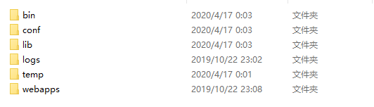
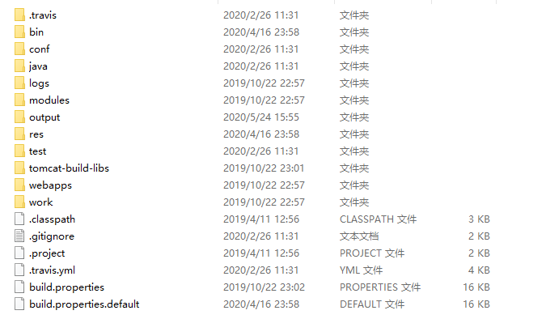
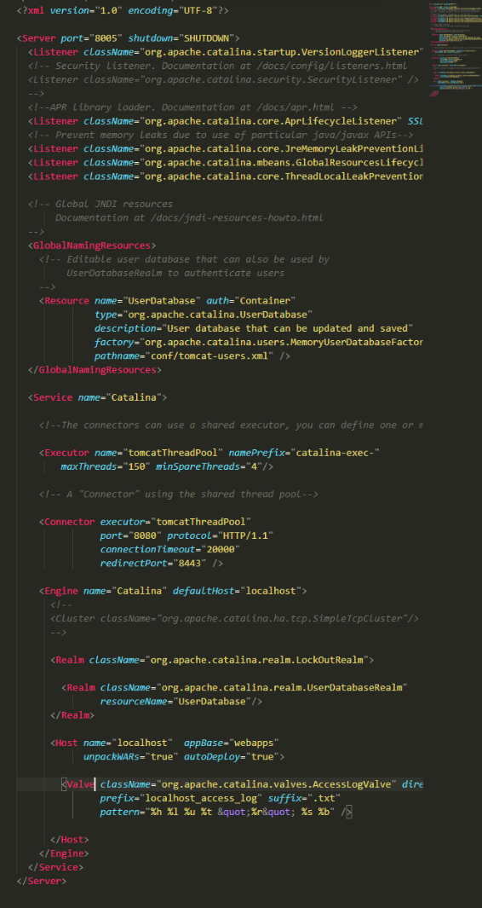

tomcat是做java web开发的开发者经常所使用的支持并运行servlet的一个中间件，不管项目是基于spring、springboot或者是纯servlet的，只要用到servlet，多多少少都离不开tomcat。经常使用tomcat而不了解其自身结构，会让开发者在处理tomcat抛出自身异常的时候变得束手无策。我也如此，在18年还在实习的时候，面对catalina.out抛出的众多的`org.apache.catalina.LifecycleException`变得束手无策，明明端口没有占用，为什么tomcat就无法启动呢？明明tomcat已经启动成功了，但为什么就是无法访问，甚至返回http 502呢？抱着好奇的态度，我去github上找到了tomcat的源码，下载并抱着专(gou)心(pi)的态度研究。直到今年疫情隔离的时候，我才有幸看懂tomcat，以此来记录我在tomcat中所获得的学习经验(*拖了整整半年才开始写第一章..*)。

> Github : https://github.com/apache/tomcat
>
> tips : master分支是持续进行更新的，也就是develop版本，稳定的版本在分支上有对应的tag。

# 1.Tomcat结构描述

要开始进行源码阅读，首先必须要熟悉tomcat的结构目录

> **注意：是release的结构目录，而不是工程目录**

## tomcat 目录描述

- ***bin***目录存放了可执行脚本及程序入口的jar包
- ***conf***目录存放了tomcat的配置文件，可以配置tomcat的安全权限策略、catalian的配置熟悉、context的路径、server的端口(最常用的)、web.xml的全局配置等配置项
- ***lib***目录存放的则是tomcat分模块生成的jar包以及tomcat对其他库的依赖包等
- ***logs***目录存放的是记录tomcat运行的日志文件
- ***temp***目录存放的是tomcat的缓存文件，如java.io.tempdir配置路径等
- ***webapps***目录存放的是servlet工程，也就是context

## tomcat 源码构建并导入IDE

> 1. 确保安装了ant，并且在cmd里ant是可用的
> 2. 确保安装了jdk8(废话太多...)

使用git，clone源码后，得到以下工程目录：

得到源码后，我们首先要做的事是：

1. 阅读BUILDING.txt，你想要的各种构建姿势文档里都有描述
2. 阅读README.md(我觉得这是混迹github上的最必不可少的操作，你要去学习(piao)各种资源时，作者写的readme文档都会让你事半功倍)
3. copy build.properties.default一份到当前目录，修改名称为去掉default就行，该配置文件用与构建tomcat时，下载的第三方构建包存放的目录

准备好以上三步后，开始进行操作。拷贝build.properties.default重名为build.properties，找到`base.path`属性项，原属性路径指向为`${user.home}/tomcat-build-libs`，我不想让他放在我的C盘中，所以我写死了路径到tomcat工程目录下

执行`ant`进行编译生成，执行时ant会去下载`bnd、cglib、commons-daemon、ecj、jaxrpc、junit、objenesis、tomcat-native、wsdl4j`等依赖包，由于节点是在国外，所以这一步的操作非常慢，有条件可以挂一个vpn，build成功后，执行`ant ide-eclipse`，生成eclipse项目的配置文件，接下来就可以导入eclipse或者IntelliJ里面了

导入进eclipse或者IntelliJ后，会显示缺失很多包依赖，这个时候就需要手动的去解决包路径的问题，如在eclipse中build-path找到tocmat-build-libs对应的jar包的路径，在idea中也是如此，解决了包依赖的问题，找到`org.apache.catalina.startup.Bootstrap`的main函数运行就可以启动tomcat了，eclipse中会弹出command选择项，如start、stop等，在idea中就需要指定VM options : start

## tomcat 启动流程

在涉及到启动流程时，要先清楚tomcat的组件有那些，这一点可以通过conf目录下的server.xml得到

- Server 代表tomcat本身
- Listener 监听器
- GlobalNamingResources JNDI资源
- Service 服务
- Executor 线程池
- Connector 连接器
- Engine 虚拟出来的主机
- Cluster 用于tomcat集群的配置
- Host 虚拟出来的Host
- Valve 阀

tomcat的组件其实不止这些，但这些是经常用的，在后续学习进度中再继续记录其他容器吧，目前提到的这些是要涉及到启动流程时使用的