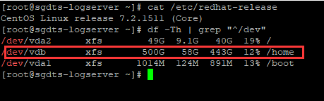
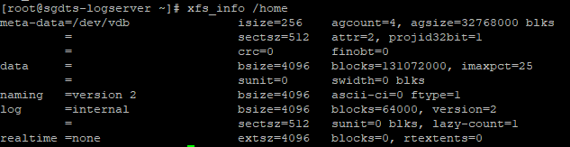

在工作中，我们会使用到由C编写的maintainclient工具进行文件相关的操作。在此之前，maintainclient在ext3或ext4文件系统的机器中运行良好。不久前，韩方运营给出了一批centos 7.2版本的机器，执行命令部署时一直失败，并且将文件夹路径直接当成文件处理。根据自己在stackoverflow上找到的一些文档和翻看其maintainclient处理文件的源码。随即定位到问题。

# 1.验证dirent能否获取到文件类型

在发现了处理文件异常后，我及时查看了maintainclient处理文件句柄的源码，发现`struct dirent* dent`获取的`d_type`始终为`DT_UNKNOWN`，于是使用以下代码验证了我的设想，即操作系统问题：

``` c++
#include <stdio.h>
#include <dirent.h>
#include <sys/stat.h>

int main(int argc, char *argv[])
{
  struct stat info;
  DIR *dirp;
  struct dirent* dent;

  //If no args
  if (argc == 1)
  {

    argv[1] = ".";
    dirp = opendir(argv[1]); // specify directory here: "." is the "current directory"
    do
    {
      dent = readdir(dirp);
      if (dent)
      {
        printf("%c ", dent->d_type);
        printf("%s \n", dent->d_name);

        /* if (!stat(dent->d_name, &info))
         {
         //printf("%u bytes\n", (unsigned int)info.st_size);

         }*/
      }
    } while (dent);
    closedir(dirp);
  }

  //If specified directory 
  if (argc > 1)
  {
    dirp = opendir(argv[1]); // specify directory here: "." is the "current directory"
    do
    {
      dent = readdir(dirp);
      if (dent)
      {
        switch (dent -> d_type)
        {
          case DT_DIR:
            printf("DIR: %d, %s\n", dent -> d_type, dent->d_name);
            break;
          case DT_REG:
            printf("FILE: %d, %s\n", dent -> d_type, dent->d_name);
            break;
          default:
            printf("Other: %d, %s\n", dent -> d_type, dent->d_name);
            break;
        }

        // printf("%c ", dent->d_type);
        // printf("%s \n", dent->d_name);
        /*  if (!stat(dent->d_name, &info))
         {
         printf("%u bytes\n", (unsigned int)info.st_size);
         }*/
      }
    } while (dent);
    
    closedir(dirp);
  }
  return 0;
}

```

# 2.验证磁盘文件类型

  因为运营方交付机器时是将磁盘格式化并挂载好的，所以我们并没有详细检查文件系统格式。于是开始对磁盘进行验证：

``` shell
df -Th | grep "^/dev"
```



maintainclient工作的磁盘格式为`XFS`，在查阅资料时被一些资料误解，以为`XFS`文件格式不支持d_type，故准备重新格式化将其换回ext3的文件格式时，在stackoverflow找到一篇帖子说他的`XFS`文件系统能正常获取到d_type，为了解决这个问题，我坚定不换文件系统，也不修改源码，并在redhat官网中查阅到了蛛丝马迹：

stackoverflow: <strong>As the readdir(3) man page points out, not all filesystems return real info in the d_type field (typically because it would take an extra disk seek to read the inode, as is the case for XFS if you didn’t use mkfs.xfs -n ftype=1 (implied by -m crc=1 which is not yet the default). Filesystems that always set DT_UNKNOWN are common in real life, and not something that you can ignore. XFS is not the only.</strong>

redhat: <strong>Note that XFS file systems must be created with the `-n ftype=1` option enabled for use as an overlay. With the rootfs and any file systems created during system installation, set the `--mkfsoptions=-n ftype=1` parameters in the Anaconda kickstart. When creating a new file system after the installation, run the `# mkfs -t xfs -n ftype=1 /PATH/TO/DEVICE` command. To determine whether an existing file system is eligible for use as an overlay, run the `# xfs_info /PATH/TO/DEVICE | grep ftype` command to see if the `ftype=1` option is enabled.</strong>

两篇文章说明`XFS`文件系统是能获取到d_type的，在格式磁盘时，如不进行设置，ftype默认是关闭的。网上给出的解释是：<strong>在一些文件系统中，比如EXT4和最近的XFS(带有元信息版本的)，会将类型信息保存在目录汇总，因此无需从磁盘加载inode即可返回类型信息。这是一个巨大的加速，类似于`find -name`，因为它不需要统计任何东西来递归子目录。但是对于不这样做的文件系统，d_type将始终为DT_UNKNOWN，因为填充它需要读取所有的inode（但它甚至不会从磁盘加载），有时你只是匹配文件名，而不需要类型信息，所以如果内核花费大量额外的CPU时间（或特别是IO时间）来填充d_type时，成本会特别高，将会变得很糟糕。d_type只是一个性能捷径。</strong>

# 3.解决办法

如果是xfs，使用`xfs_info /dir`查看ftype，如果为0，则dirent->d_type无法正确读取文件类型，必须对磁盘重新格式化。

``` shell
umount /dev/vdb # 卸载磁盘
mkfs.xfs -n ftype=1 /dev/vdb # 格式化磁盘，并设置ftype=1
mount /dev/vdb /home # 挂载磁盘
```



此时d_type能正常获取，在对文件系统重新格式后，我们对maintainclient做了兼容，在使用readdir的同时也兼容了lstat获取文件信息。


# 4.参考链接：

[https://www.it1352.com/1558973.html](https://www.it1352.com/1558973.html)

[https://xfs.org/index.php/XFS_Papers_and_Documentation](https://xfs.org/index.php/XFS_Papers_and_Documentation)

[https://blog.csdn.net/weixin_43269580/article/details/115391567](https://blog.csdn.net/weixin_43269580/article/details/115391567)

[https://www.linuxquestions.org/questions/programming-9/readdir-on-centos-7-a-4175535726/](https://www.linuxquestions.org/questions/programming-9/readdir-on-centos-7-a-4175535726/)

[https://stackoverflow.com/questions/39429803/how-to-list-first-level-directories-only-in-c/39430337#39430337](https://stackoverflow.com/questions/39429803/how-to-list-first-level-directories-only-in-c/39430337#39430337)

[https://access.redhat.com/documentation/en-us/red_hat_enterprise_linux/7/html/7.2_release_notes/technology-preview-file_systems](https://access.redhat.com/documentation/en-us/red_hat_enterprise_linux/7/html/7.2_release_notes/technology-preview-file_systems)


[https://sourcegraph.com/search?q=context:global+repo:%5Egithub%5C.com/torvalds/linux%24+file:%5Efs/xfs+ftype&patternType=literal](https://sourcegraph.com/search?q=context:global+repo:%5Egithub%5C.com/torvalds/linux%24+file:%5Efs/xfs+ftype&patternType=literal)

