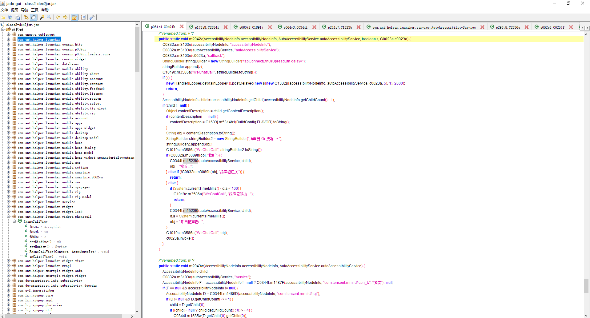

# 应用宝、酷安的android APK脱壳过程

找到一个实现了自动拨打和接听微信语音、视频的软件、以及低电量报警，并自带老年桌面的一个launcher应用，下载下来后发现使用dextools、jadx、apktool均无法获取到包里的内容，仅可读R.java，猜测可能上架应用市场后由应用市场进行了加壳。

## 环境准备

根据Google到的知识，可以使用将apk安装后加载到内存后进行dump脱壳。使用如下技术：

- frida

- frida-tools

- frida-server （android）

- dextools + jad 对脱壳后的dex进行反编译

- apktool 对资源进行反编译

## PC上安装frida工具

```batch
pip install frida
pip install frida-tools
```

## 宿主机安装frida-server

> 选择对应的CPU架构的frida-server动态库，<u>并确保宿主机已经root</u>

首先查看cpu架构，我使用的emulator，所以我选择的是x86_64的架构， android版本为R(11)，在AVD中选中R(11) Google APIs（一定要带APIs的，否则不能root，frida-server不能启用）。

```batch
adb shell getprop ro.product.cpu.abi

x86_64
```

然后到[GitHub发布的Releases · frida/frida](https://github.com/frida/frida/releases)中下载对应的CPU处理架构的frida-server，frida-server与frida的版本要尽可能一致。完成后进行解压，。我这儿为<code>frida-server-16.4.7-android-x86_64.xz</code>。

将<code>frida-server-16.4.7-android-x86_64</code>拷贝至宿主机（拷贝前确保宿主机能获取到root权限），为frida-server赋予执行的权限。

```batch
adb root

adb push <path>/frida-server-16.4.7-android-x86_64 /data/local/tmp

rem 使用adb切换到shell
adb shell
```

为frida-server赋予执行的权限，并运行。

```bash
chmod +x /data/local/tmp/frida-server-16.4.7-android-x86_64

cd /data/local/tmp

./frida-server-16.4.7-android-x86_64
```

## 验证frida是否成功

在PC上新创建一个命令行窗口，输入以下命令来查看当前手机进程列表

```batch
frida-ps -U
```

**case1**. 如果出现以下错误提示，则需要将手机数据线拔下来重新插一次，然后重新运行一遍上面的命令即可。

```batch
Failed to enumerate processes: unable to handle 64-bit processes due to build configuration
```

**case2**. 如果出现以下错误提示，证明端口被占用了，可以重启一下手机。

```batch
Unable to start: Could not listen on address 127.0.0.1, port 27042: Error binding to address 127.0.0.1:27042: Address already in use
```

**case3.** 如果出现以下列表，则表示frida已经安装成功。

```batch
PID  Name
----  -------------------------------------------------------------
4480  Gmail
1654  Google
4815  Google Play Movies & TV
2731  Phone
5412  Photos
6527  Settings
6327  adbd
 213  android.hardware.atrace@1.0-service
 298  android.hardware.audio.service.ranchu
 299  android.hardware.authsecret@1.0-service
 446  android.hardware.biometrics.face@1.0-service.example
 447  android.hardware.biometrics.fingerprint@2.1-service
```

最后再进行端口映射

```batch
adb forward tcp:27042 tcp:27042
```

## 使用frida脚本进行脱壳

我这儿是在github上找的frida脱壳脚本，如果对frida熟悉的可以自行编写脚本，或自行寻找能用的脚本。前往[GitHub下载frida_dump/dump_dex.js](https://github.com/lasting-yang/frida_dump/blob/master/dump_dex.js)。

```batch
rem dump_dex.js为下载的frida脚本文件，--no-pause我这儿找不到该命令，可以不填
frida -U -f <packageName> -l dump_dex.js --no-pause
```

**case 1.** 因MagiskHide导致的执行失败

```batch
Failed to spawn: unable to access PID 765 (zygote64) while preparing for app launch; try disabling Magisk Hide in case it is active
```

解决办法

```batch
Magisk 管理器 -> 设置 -> Magisk 选项 -> MagiskHide（关闭即可）

rem 或使用adb进行关闭
adb shell "su -c magiskhide disable"

rem 完事后可以执行该命令进行开启
adb shell "su -c magiskhide enable"
```

**case 2.** 因脚本报错

```batch
C:\Users\MORTAT\Desktop\launcher> frida -U -f com.ant.helper.launcher -l .\OpenMemory.js
     ____
    / _  |   Frida 16.4.7 - A world-class dynamic instrumentation toolkit
   | (_| |
    > _  |   Commands:
   /_/ |_|       help      -> Displays the help system
   . . . .       object?   -> Display information about 'object'
   . . . .       exit/quit -> Exit
   . . . .
   . . . .   More info at https://frida.re/docs/home/
   . . . .
   . . . .   Connected to Android Emulator 5554 (id=emulator-5554)
Spawned `com.ant.helper.launcher`. Resuming main thread!
Error: expected a pointer
    at value (frida/runtime/core.js:408)
    at <eval> (C:\Users\MORTAT\Desktop\launcher\OpenMemory.js:32)
```

替换你的frida脚本。

**case3.** 执行成功

```batch
C:\Users\MORTAT\Desktop\launcher> frida -U -f com.ant.helper.launcher -l .\dump_dex.js
     ____
    / _  |   Frida 16.4.7 - A world-class dynamic instrumentation toolkit
   | (_| |
    > _  |   Commands:
   /_/ |_|       help      -> Displays the help system
   . . . .       object?   -> Display information about 'object'
   . . . .       exit/quit -> Exit
   . . . .
   . . . .   More info at https://frida.re/docs/home/
   . . . .
   . . . .   Connected to Android Emulator 5554 (id=emulator-5554)
Spawning `com.ant.helper.launcher`...
_ZN3art11ClassLinker11DefineClassEPNS_6ThreadEPKcmNS_6HandleINS_6mirror11ClassLoaderEEERKNS_7DexFileERKNS_3dex8ClassDefE 0x78dc7b58ac90
[DefineClass:] 0x78dc7b58ac90
Spawned `com.ant.helper.launcher`. Resuming main thread!
[Android Emulator 5554::com.ant.helper.launcher ]-> [find dex]: /data/data/<pre-initialized>/files/dump_dex_<pre-initialized>/class.dex
Error: No such file or directory
    at onEnter (C:\Users\MORTAT\Desktop\launcher\dump_dex.js:96)
[find dex]: /data/data/<pre-initialized>/files/dump_dex_<pre-initialized>/class.dex
Error: No such file or directory
    at onEnter (C:\Users\MORTAT\Desktop\launcher\dump_dex.js:96)
[find dex]: /data/data/com.ant.helper.launcher/files/dump_dex_com.ant.helper.launcher/class.dex
[dump dex]: /data/data/com.ant.helper.launcher/files/dump_dex_com.ant.helper.launcher/class.dex
[find dex]: /data/data/com.ant.helper.launcher/files/dump_dex_com.ant.helper.launcher/class2.dex
[dump dex]: /data/data/com.ant.helper.launcher/files/dump_dex_com.ant.helper.launcher/class2.dex
[find dex]: /data/data/com.ant.helper.launcher/files/dump_dex_com.ant.helper.launcher/class3.dex
[dump dex]: /data/data/com.ant.helper.launcher/files/dump_dex_com.ant.helper.launcher/class3.dex
[find dex]: /data/data/com.ant.helper.launcher/files/dump_dex_com.ant.helper.launcher/class4.dex
[dump dex]: /data/data/com.ant.helper.launcher/files/dump_dex_com.ant.helper.launcher/class4.dex
[find dex]: /data/data/com.ant.helper.launcher/files/dump_dex_com.ant.helper.launcher/class5.dex
[dump dex]: /data/data/com.ant.helper.launcher/files/dump_dex_com.ant.helper.launcher/class5.dex
[find dex]: /data/data/com.ant.helper.launcher/files/dump_dex_com.ant.helper.launcher/class6.dex
[dump dex]: /data/data/com.ant.helper.launcher/files/dump_dex_com.ant.helper.launcher/class6.dex
```

将dump后的dex文件拷贝到本机使用jadx反编译。

```batch
adb pull /data/data/com.ant.helper.launcher/files/dump_dex_com.ant.helper.launcher F:/dump_dex
```

## Finally




## 参考链接

[掘金论坛的 Android 逆向之脱壳实战篇](https://juejin.cn/post/7245854874196475963)

[https://github.com/lasting-yang/frida_dump](https://github.com/lasting-yang/frida_dump)