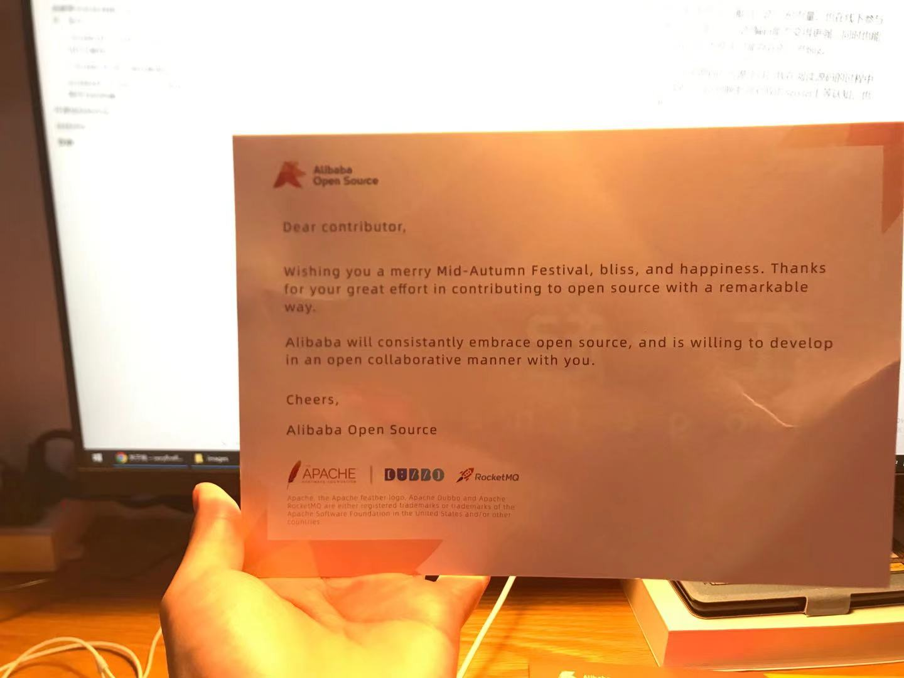

# 联系方式

- Email：<a href="mailto:993610942@qq.com">993610942@qq.com</a>
- QQ/微信号：<a target="_blank" href="http://wpa.qq.com/msgrd?v=3&uin=993610942&site=qq&menu=yes">993610942</a>
- website : [http://www.likeu.cool/](http://www.likeu.cool/ "http://www.likeu.cool/")

---

# 个人信息

 - 最红/男/1997 
 - 工作年限：3.5年
 - 技术博客：[https://veryfirefly.github.io](https://veryfirefly.github.io "https://veryfirefly.github.io")
 - Github：[https://github.com/veryfirefly](https://github.com/veryfirefly "https://github.com/veryfirefly")
 - Gitee：[https://gitee.com/GangHuo_admin](https://gitee.com/GangHuo_admin "https://gitee.com/GangHuo_admin")
 - 期望职位：Java高级程序员
 - 期望薪资：税前月薪**12k-15k**
 - 期望城市：成都

---

# 工作经历

## 成都聚乐科技有限公司 （2017年12月 - 至今）

### 1. 2018年4月-2018年7月  点球大战（H5小游戏）

该项目为2.5D的点球大战小游戏，对接**IGXE平台**接入该游戏，玩家可在平台中兑换CS:GO的皮肤等。

在该项目中遇到的问题和解决思路及该项目对我的能力提升：

1. 初期采用Adobe Animate编写，无法模拟玩家踢出球之后，足球的运行轨迹及下降轨迹。于是我另辟蹊径使用了Cannon.js（WebGL物理引擎）负责实现游戏中的物理效果模拟，并采用Three.js实现Graphics Render，及为2D图片的足球绑定一个3D不可视的球形物理碰撞。
2. chrome由于安全策略的问题无法自动播放音频。我是用了Sound.js加载音频，由于chrome自动播放音频的策略问题，只有在玩家加载完游戏后点击进入游戏时自动播放音频。
3. 在该项目中，我还使用了Tween.js实现加载动画及过场动画。
4. 在该项目中，我使用的是原生Servlet进行开发进球率及判断球是否成功射进的后端逻辑及后台数据管理页面。
5. 在该项目中，我负责对接IGXE，对接IGXE提供的**兑入兑出接口**、**用户日志上报接口**、**游戏内跳转商城链接接口**，并负责为其提供**用户信息查询接口**、**查询账号金币接口**、**进球率控制接口**等

游戏截图：

### 2. 2018年7月-至今 游戏管理后台

该项目为游戏管理后台的trunk项目，游戏每次迭代时后台也会随之基于该管理后台进行迭代开发。但由于该项目诞生时，公司不太注重数据查询这块，只要求能替换人工SQL查询数据的工作，所以时至今日，我的工作核心一直是优化演进后台项目。我们的游戏后台分为3大内容，1：游戏管理后台，该项目负责为策划提供数据查询类和游戏指令操作等功能。2：游戏对外接口，该项目负责为平台提供查询接口及游戏指令操作接口。3：游戏数据存储，该项目承担接收游戏内的日志数据上报，并持久化到mysql中，也为游戏后台提供查询的功能。

在该项目中遇到的问题及解决思路：

1. 游戏内移除日志数据的记录后，将数据上报至logserver中，由于后台存放充值的库和存放游戏内产生的数据的库是不同的库，故无法联表查询（数据库使用的是mysql），其同事负责该功能的编写，为了实现查询数据，则使用迭代执行SQL查询。在最坏的情况下会产生 （数据条数 * 获取某个日志的信息的条数）* 服务器数量的SQL查询（项目初中期时，一个功能查询就有15万条SQL）和返回10G+的数据，无法处理并造成后台崩溃。于是使用了mysql的federated引擎进行连库连表查询（实验性功能）。后期继续优化该功能，优化表索引，并将充值信息数据也上报至存放game log的游戏库中。
2. 负责为平台对接并提供**登录**、**充值**、**账号封禁**、**聊天监控**、**上报日志数据到平台中的接口**、**通行证直购**。（平台对接）
3. 排查并优化线上logserver。在我负责该项目时，由于早期项目为确保稳定性，使用的是tomcat7，并且同事未对tomcat及项目进行优化，所以在游戏大推时，会造成logserver宕机不工作的问题。我负责后，排查线上项目故发现mysql的最大连接数分配不合理、项目中使用了队列进行数据处理时由于一直new对象，造成Eden Space内存占用高GC太频繁、该项目为IO密集型，但使用的是tomcat BIO线程模型，无法最大化利用cpu资源。我对项目进行了池化对象处理，用于减少GC次数，回收并重复利用StoreRecord对象，优化JDBC配置，以达到最适合生产环境的配置，调整tomcat线程模型为NIO，并指定最小、最大堆内存和开启GC日志输出用于后期排查问题。
4. 2019年10月对接游族渠道时，遇到了chrome无法拉起自定义协议的程序的问题。这部分工作内容是我们游戏客户端同事负责的，但是当时因为他比较忙，而且该问题涉及网页登录拉起游戏的问题，所以叫我排查。我查阅了chrome的更新日志后，发现在v74版本，chrome对自定义协议的注册表的格式做了严格处理，于是在对比了百度云网盘后发现了我们插件中的注册表的不同解决了该问题。但后期出现了在https下，chrome由于安全策略无法拉起自定义协议程序。在排查下，发现了iframe中嵌套了http的链接，导致chrome认定该页面不安全故解决该问题。
5. 2020年9月-至今，负责并尝试使用SpringBoot重写游戏后台，并与游戏逻辑探讨约定数据上报方式和上报容灾处理，在这次迭代中，我们尝试引入了clickhouse替换持久化组件和数据分析，使用kafka承担日志数据上报职责，尽可能容灾处理。逐步迁移到新的架构中。
6. 修复维护外网线上工程出现的问题。完善并实现策划的数据查询需求。

### 2018年8月-2019年1月 乐玩无限官网平台的构建

该项目为北京运营平台的官网。用户可在该官网进行充值、游戏登录等。

1. 在该项目中，我负责充值平台的构建，并对接中信银行的支付接口。
2. 在该项目中，我负责账号模块、游戏列表模块的构建。

---

# 开源项目和作品

在尝试阅读过tomcat源码后，我喜欢在github上寻找优秀的作品和为作品贡献自己的一份力量。也在线下参与过Alibaba、Meituan组织的开源Meet Up。我个人认为在开源项目也能让自己的编码能力变得更强，同时也能让自己熟识项目中使用的组件的原理及掌握使用组件，并且也能找出组件中可能存在的一些bug。

1. 因为自身的工作离不开Tomcat，所以Tomcat成为了我第一个阅读源码的开源项目。我在阅读源码的过程中逐渐掌握了Tomcat的内部组件，Tomcat组件的启动流程，接收Socket到映射到对应的Servlet上等认知，也让我逐渐能对Tomcat进行调优和对Tomcat的异常进行处理。
2. 我在2019年3月份的成都线下Meet Up时成为了Apache RocketMQ的Contributor，在RocketMQ中我逐渐熟悉了Netty的TCP沾包与解包的处理、顺序读写的处理。
3. 有了这两次经验后，我开始阅读Mybatis的源码，相比与上面两个组件，Mybatis要简单的多，但设计的也很精妙。阅读Mybatis使我对Java的反射有了更深层次的认知。
4. 后续我进行阅读了FastJSON库，由于FastJSON的JSONObject类的构造函数不太合理，后续我尝试并为其提交了关于JSONObject构造函数的代码，以让JSONObject支持更复杂类型的传参构造。
5. 目前由于微服务很火，在工作之外尝试构建了spring-cloud-alibaba，由于nacos整合了config和naming-server这块，所以我对nacos也比较感兴趣，阅读了nacos的naming模块，逐渐熟知nacos里的组件区分（Server-Service-Cluster-Instance），很荣幸也成为了nacos的contributor为社区贡献一份力量。

# 自我评价

喜欢用思考的方式去对待每一件事情。热爱编程，在对工作尽责之外，乐与从开源社区中提升自己，对工作踏实有耐心，抗压能力强。热爱钻研新兴架构和技术。

# 致谢

感谢您花时间阅读我的简历，期待能有机会和您共事。